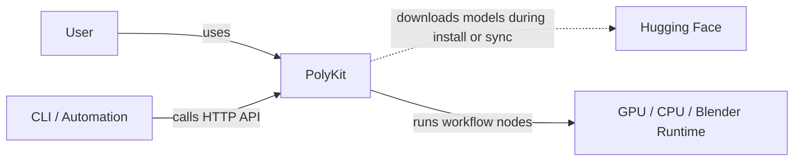
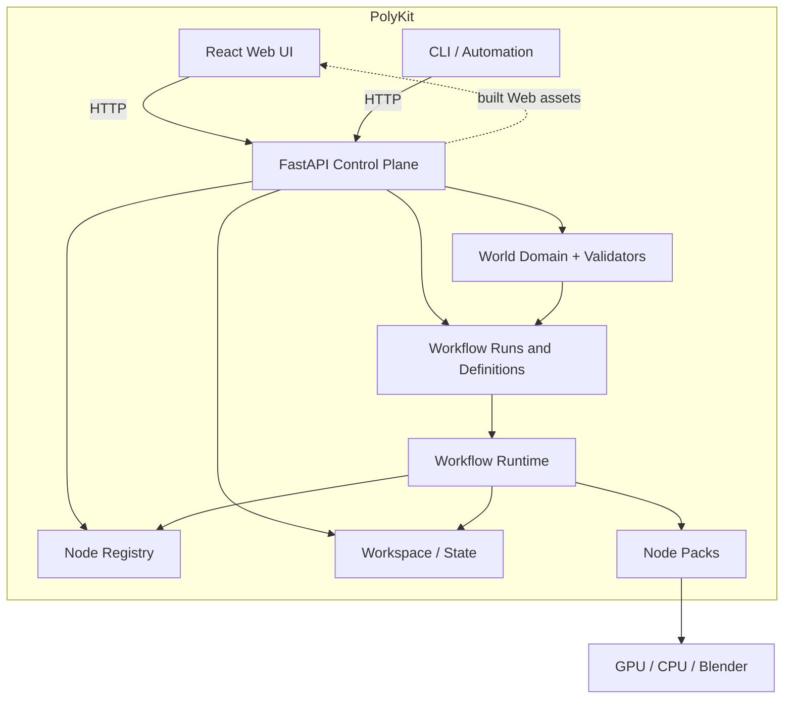
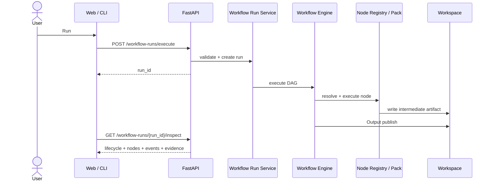
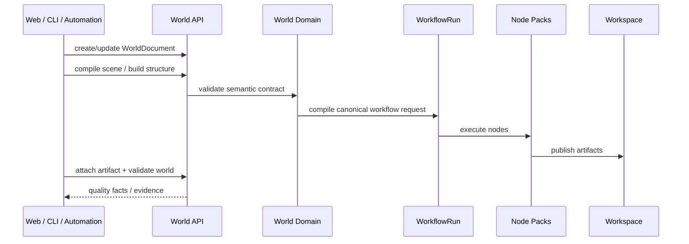
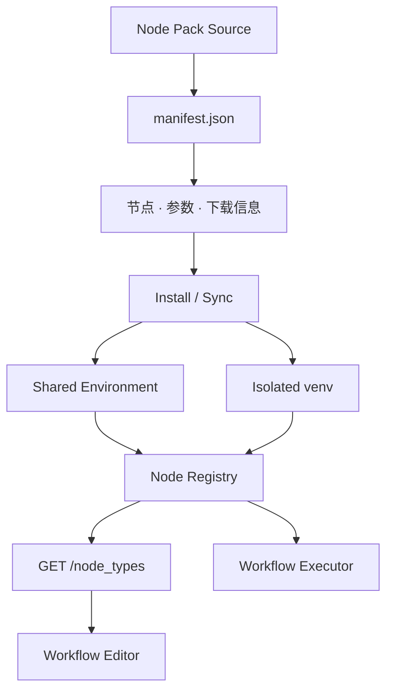

# PolyKit Architecture

PolyKit 的核心原则是：**FastAPI 是权威运行时，React Web、CLI 和其他自动化调用方都是客户端。**

工作流执行、任务状态、可编辑工作流定义、World domain、Node Pack 注册、模型进程和服务端工作区都由 FastAPI 统一管理。客户端通过相同的 HTTP API 使用这些能力，不复制一套产品逻辑，也不引入第二个 durable task runtime。

本文只描述稳定的系统边界和运行时概念。API 细节由 OpenAPI 文档提供，实现细节以源码为准。

## 1. Architecture at a Glance

### C1 — System Context



## 2. Containers

### C2 — Container Diagram



FastAPI 既提供 API，也可以托管构建后的 Web 文件。CLI 不复制产品逻辑，只调用相同的服务端合约。

Blender MCP 若被开发者或外部工具使用，是独立 authoring integration，不属于上述产品 control plane。

## 3. Backend Components

### C3 — FastAPI / Workflow Runtime

```mermaid
flowchart TB
    Routers[API Routers]
    World[World Domain\ncompiler · validators · recipes]
    RunService[Workflow Run Service\nvalidation · lifecycle · observability]
    Engine[Workflow Engine\nDAG ordering · references · cache]
    Registry[Node Registry\nbuiltin · model · process]
    ModelExec[Model Node Executor]
    ProcessRunner[Process Node Runner]
    Generators[Generator Registry]
    Workspace[Workspace / State]

    Routers --> World
    Routers --> RunService
    World --> RunService
    RunService --> Engine
    Engine --> Registry
    Engine --> ModelExec
    Engine --> ProcessRunner
    ModelExec --> Generators
    ModelExec --> Workspace
    ProcessRunner --> Workspace
    Engine --> Workspace
```



Node Registry 把 builtin、model 和 process 三类节点合并成统一节点契约。编辑器从 `GET /node_types` 获取可用节点，执行器使用同一份注册信息解析和运行节点。

## 4. Core Runtime Concepts

### Workflow

Workflow 是带类型约束的 DAG。可编辑定义通过 `/workflow-definitions/*` 保存，运行通过 `/workflow-runs/*` 提交、查询、inspect 和取消。定义本身不等于某一次运行。

### WorkflowRun

一次工作流提交创建一个持久可查询的 run。Run Service 负责校验、排队、生命周期、取消和 observability。节点快照、当前节点、事件、错误、artifact/evidence refs 都属于 run。

`inspect` 是只读操作：它描述发生了什么和正在发生什么，不推进、重试或改变运行。

### WorldDocument

Schema-v2 WorldDocument 保存世界的领域事实：intent、BuildSpec、ScenePlan、GameSpec、quality facts 和 artifact references。

它不保存工作流阶段进度。可以把边界理解为：

```text
WorldDocument = what the world is
WorkflowRun   = what computation is/was running
```

World domain compiler/validators 可以生成标准 WorkflowRun request 或检查 run evidence，但不会创建另一套 Agent/session 状态机。详细约定见 [World Builder](world-builder.md)。

### Node

Node 声明输入、输出、参数和执行来源：

- **builtin**：内置图片、文本、网格、预览和输出节点。
- **model**：调用生成模型。
- **process**：调用网格处理、Blender 或其他后处理器。

### Node Pack

Node Pack 是可安装的模型或处理能力单元。`manifest.json` 声明节点、参数、输入输出和下载元数据；安装流程准备共享环境或隔离虚拟环境；Node Registry 注册完成后，Web、CLI 和执行器看到同一组能力。

详细约定见 [Node Packs & Workflow Templates](node-packs.md)。

### Workspace / Artifact

Workspace 是服务端拥有的持久文件空间。浏览器上传文件后，工作流引用 workspace-relative path，不依赖客户端机器的绝对路径。

中间 artifact 写入：

```text
<WORKSPACE_DIR>/.artifacts/<run-id>/
```

只有 Output sink 才把最终结果 publish 到用户可见的 workspace collection。World artifact binding 也通过服务端 domain API 完成，CLI 不直接改 World JSON。

## 5. Key Runtime Flows

### Workflow Execution



### World Build



### Node Pack Registration



安装只准备运行环境和注册信息，不在每次工作流运行时静默安装依赖。

## 6. Repository Map

```text
src/                         React Web、共享类型和 UI
src/areas/workflows/         工作流编辑器、模板和运行状态
src/areas/assets/            资产库和 3D 预览
src/areas/worlds/            Three.js world runtime / viewer
api/main.py                  FastAPI 应用和路由组合
api/routers/                 HTTP API 边界
api/services/                domain、运行时、执行器和工作区服务
node-packs/                  仓库内置的官方 Node Pack
tools/polykit-cli/           标准库 CLI API 客户端
docs/                        用户、架构和专题文档
```

## 7. Design Principles

- **Server is authoritative**：执行、状态、定义、World rules 和 workspace persistence 由 FastAPI 管理。
- **Clients share the API**：Web、CLI 和自动化调用方不复制业务逻辑。
- **One run lifecycle**：长任务使用 WorkflowRun，不引入第二个 durable task runtime。
- **World state is domain state**：WorldDocument 不持有聊天/session/stage orchestration。
- **One registry contract**：builtin、model 和 process 节点对编辑器和执行器统一暴露。
- **Workflow is a typed DAG**：执行前校验类型和拓扑。
- **Runtime state stays outside the source tree**：模型、环境、workspace 和 run artifacts 不写入源码目录。
- **Intermediate artifacts are isolated**：只有 Output sink 发布用户资产。

## 相关文档

- [PolyKit 用户指南](user-guide.md)
- [World Builder](world-builder.md)
- [Workflow observability](workflow-observability.md)
- [Node Packs & Workflow Templates](node-packs.md)
- [Mesh Segmentation Workflow](mesh-segmentation-workflow.md)
- [在 Jetson 上运行](running-on-jetson.md)
