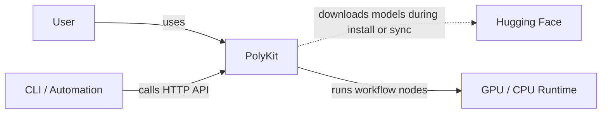
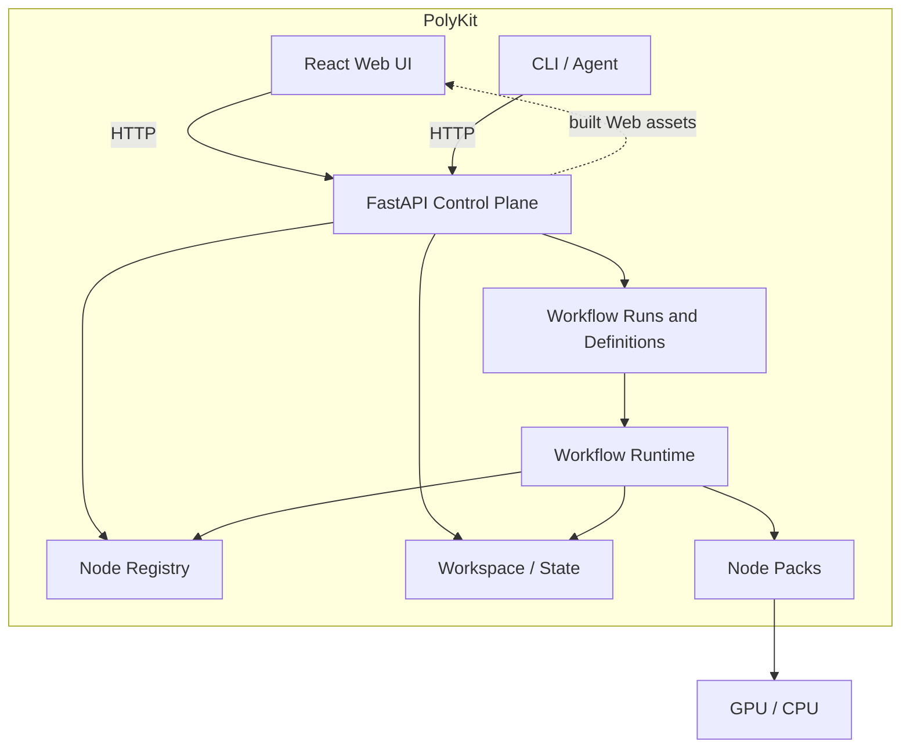
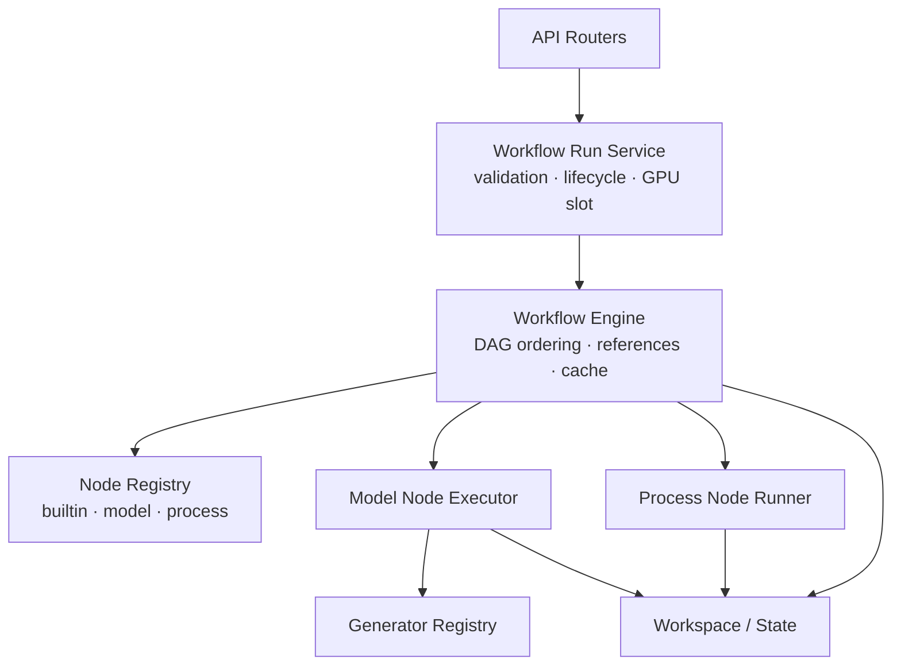
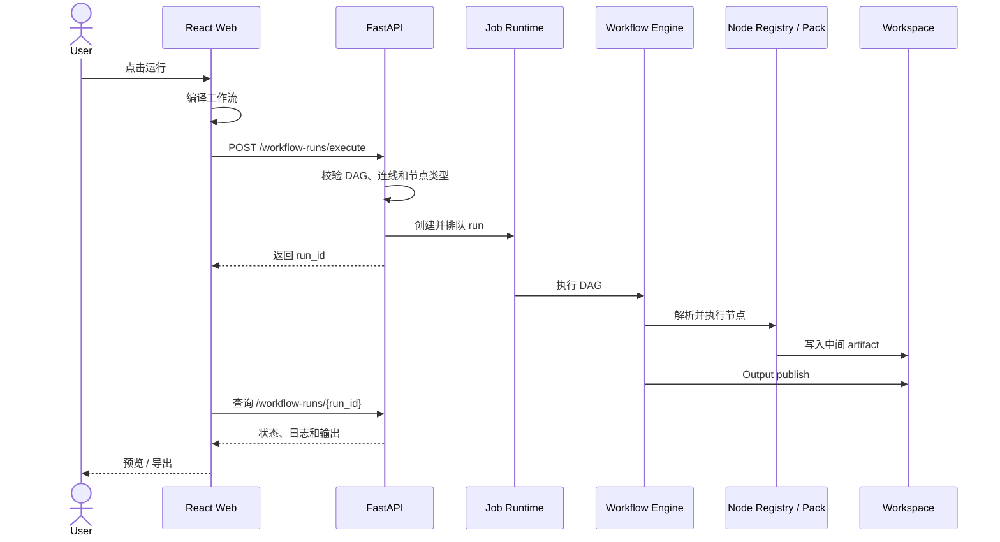
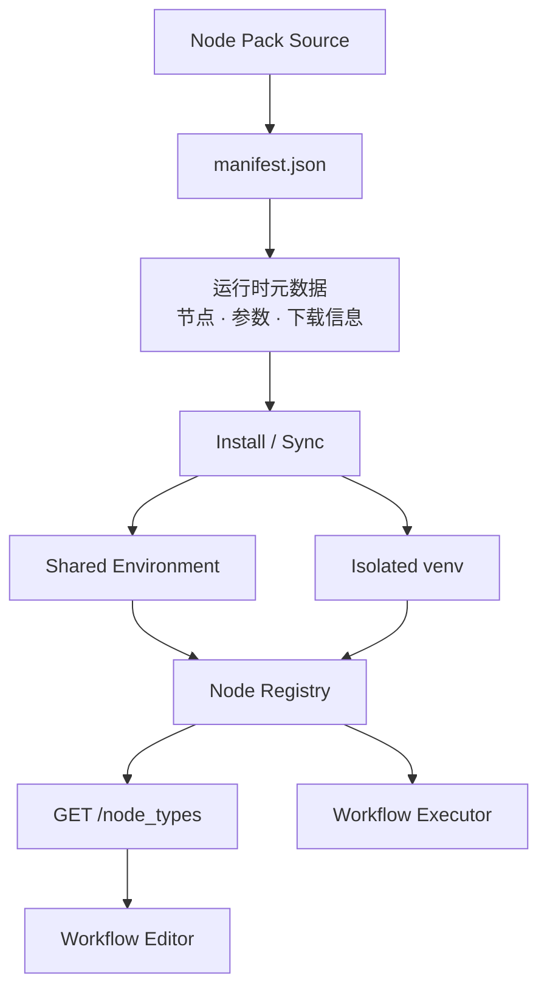
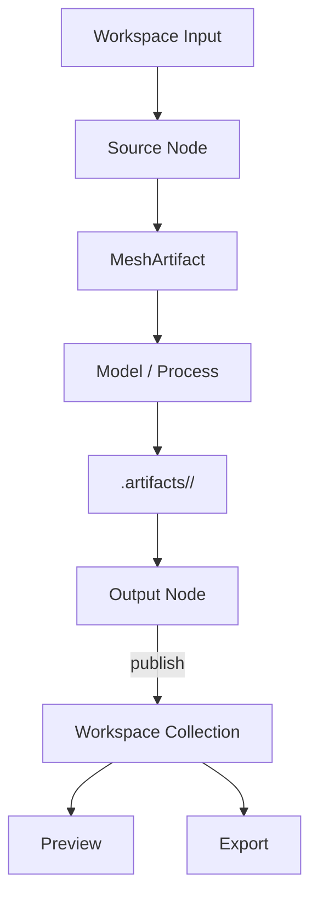

# PolyKit Architecture

PolyKit 的核心原则是：**FastAPI 是权威运行时，React Web 和 CLI 都是客户端。**

工作流执行、任务状态、可编辑工作流定义、Node Pack 注册、模型进程和服务端工作区都由 FastAPI 统一管理。Web 与 CLI 通过相同的 HTTP API 使用这些能力，Electron 不是产品运行时的一套副本。

本文只描述稳定的系统边界和运行时概念，不枚举所有 API 或 React 组件。API 细节由 OpenAPI 文档提供，实现细节以源码为准。

## 1. Architecture at a Glance

### C1 — System Context

PolyKit 位于用户、自动化工具、模型仓库和计算运行时之间：



这里不展开 React、FastAPI 或 WorkflowEngine；它们属于 PolyKit 内部实现。

## 2. Containers

### C2 — Container Diagram



FastAPI 既提供 API，也可以托管构建后的 Web 文件。CLI 不复制产品逻辑，只调用相同的服务端合约。

## 3. Backend Components

### C3 — FastAPI / Workflow Runtime



Node Registry 把 builtin、model 和 process 三类节点合并成统一的节点契约。编辑器从 `GET /node_types` 获取可用节点，执行器使用同一份注册信息解析和运行节点。

## 4. Core Runtime Concepts

### Workflow

Workflow 是带类型约束的 DAG。可编辑定义通过 `/workflow-definitions/*` 保存，运行通过 `/workflow-runs/*` 提交、查询、重连和取消。定义本身不等于某一次运行。

### Node

Node 声明输入、输出、参数和执行来源。来源主要分为：

- **builtin**：内置的图片、文本、网格、预览和输出等节点。
- **model**：调用生成模型的节点。
- **process**：调用网格处理或其他后处理器的节点。

### Node Pack

Node Pack 是一个可安装的模型或处理能力单元。`manifest.json` 声明节点、参数、输入输出和下载元数据；安装流程准备共享环境或隔离虚拟环境；Node Registry 注册完成后，Web 和执行器就能看到同一组节点。

详细约定见 [Node Packs & Workflow Templates](node-packs.md)。

### Workspace

Workspace 是服务端拥有的持久化文件空间，包含上传输入、已发布输出、缩略图、预览和工作流相关数据。浏览器上传文件后，工作流引用的是工作区相对路径，不依赖浏览器机器的绝对路径。

### Artifact

工作流中的网格值以 `MeshArtifact` 传递。中间结果写入：

```text
<WORKSPACE_DIR>/.artifacts/<run-id>/
```

中间 artifact 用于同一次 DAG 执行和节点缓存；只有 Output sink 才会把最终结果 publish 到用户可见的工作区集合。这样可以避免每个节点直接修改用户资产目录。

### Job / Run

一次工作流提交会创建一个可查询的 run。Run Service 负责校验、排队、生命周期、取消和 GPU 执行槽；Web 和 CLI 可以通过 run ID 查询状态并在断线后重连。

## 5. Key Runtime Flows

### Workflow Execution



执行器会先完成 schema、拓扑顺序、未知节点、sink 和 link 类型检查，再进入异步任务。Workflow Engine 负责引用解析、拓扑执行、节点缓存和 artifact 生命周期。

### Node Pack Registration



安装只准备运行环境和注册信息，不在每次工作流运行时静默安装依赖。Node Pack 的安装或 Repair 流程失败时，应给出可操作的环境提示。

### Artifact Lifecycle



中间结果可以被下游节点读取或被缓存复用，但不会因为一次中间节点执行就直接出现在用户资源集合里。运行结束或被清理时，服务端只回收该 run 自己的 artifact 目录。

## 6. Repository Map

```text
src/                         React Web、共享类型和 UI
src/areas/workflows/         工作流编辑器、模板和运行状态
src/areas/assets/            资产库和 3D 预览
api/main.py                  FastAPI 应用和路由组合
api/routers/                 HTTP API 边界
api/services/                运行时、注册表、执行器和工作区服务
node-packs/                  仓库内置的官方 Node Pack
tools/polykit-cli/            标准库 CLI API 客户端
docs/                        用户、架构和专题文档
```

## 7. Design Principles

- **Server is authoritative**：执行、状态、定义和工作区持久化由 FastAPI 管理。
- **Web / CLI share the API**：客户端不复制另一套生成或工作流逻辑。
- **One registry contract**：builtin、model 和 process 节点通过 Node Registry 对编辑器和执行器统一暴露。
- **Workflow is a typed DAG**：连线在执行前校验类型和拓扑，运行按依赖顺序进行。
- **Runtime state stays outside the source tree**：模型、环境、工作区和运行产物不写入源码目录。
- **Intermediate artifacts are isolated**：中间结果保存在 run 专属目录，只有 Output sink 发布用户资产。

## 相关文档

- [PolyKit 用户指南](user-guide.md)
- [Node Packs & Workflow Templates](node-packs.md)
- [Mesh Segmentation Workflow](mesh-segmentation-workflow.md)
- [在 Jetson 上运行](running-on-jetson.md)
