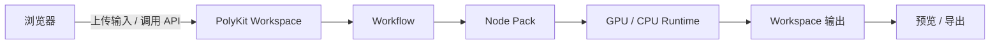

# PolyKit 用户指南

PolyKit 是一个面向本地或远程 GPU 的图像生成 3D 工作台。浏览器负责交互，PolyKit Server 负责工作流执行、模型运行、文件保存和任务状态。

## 1. PolyKit 是怎么工作的

一次典型任务会经过这条路径：



Workspace 属于服务端，不是浏览器的本地文件系统。浏览器上传的图片会先保存到服务端工作区，工作流只引用工作区路径；因此浏览器和 GPU 可以位于不同机器上。

## 2. 第一次启动

### 安装依赖

需要 Node.js、Python 3.10+、[uv](https://docs.astral.sh/uv/) 以及模型实际运行所需的 CUDA 或 CPU 环境：

```bash
git clone https://github.com/mousebar01/PolyKit.git
cd PolyKit
uv sync --python 3.11
npm install
```

### 启动 Web

```bash
npm run web:serve
```

打开 <http://127.0.0.1:8765>。没有 CUDA 时，可以使用 fake executor 验证界面和工作流链路：

```bash
POLYKIT_EXECUTOR=fake npm run web:serve
```

### 准备 Node Pack 和模型

1. 打开“节点包”页面，安装工作流所需的模型或处理器 Node Pack。
2. 按 Node Pack 页面提示下载模型权重。
3. 需要访问 gated/private Hugging Face 仓库时，设置 `HF_TOKEN` 或 `HUGGING_FACE_HUB_TOKEN`。

Node Pack 的环境、安装和权重约定见 [Node Packs & Workflow Templates](node-packs.md)。Jetson 的额外准备步骤见 [在 Jetson 上运行](running-on-jetson.md)。

## 3. 完成第一个 Image → 3D 任务

1. 打开“工作流”页面，选择一个已经验证过的模板。
2. 确认模板所需的 Node Pack 已安装并准备好模型权重。
3. 在图片输入节点选择或上传图片。
4. 点击运行，等待服务端完成工作流。
5. 在运行状态中查看进度；完成后，从“资源”页面打开生成的模型。
6. 在 3D 预览中检查结果，需要时导出 GLB 或其他可用格式。

典型工作流如下：

```text
Image / Text / Mesh
        ↓
   Model / Process
        ↓
      Output
```

模型节点负责生成，处理节点负责修复、分件或纹理等后处理，输出节点负责把结果发布到工作区资源集合。

## 4. 四个主要页面

### 资源

查看服务端工作区中的输入、生成结果和历史资产。资源可以预览、重命名、导出或继续作为工作流输入。

### 工作流

编辑节点和连线，保存可复用的工作流定义，并提交工作流运行。工作流定义由服务端保存，刷新浏览器不会丢失。

### 节点包

安装和管理模型节点、处理节点及其运行环境。这里也能查看依赖状态和模型权重准备情况。

### 设置

配置服务地址、存储目录、网络代理、集成和其他运行选项。设置影响的是服务端运行时，而不是浏览器单独保存的一份配置。

## 5. Workflow 基本概念

- **节点（Node）**：声明输入、输出和参数的可执行步骤。
- **边（Edge）**：连接节点的有向关系，连接会检查输入输出类型。
- **DAG**：工作流必须是无环有向图，服务端会按依赖顺序执行。
- **Source**：提供图片、文本或网格等输入。
- **Model / Process**：执行生成或处理。
- **Output**：把最终结果发布到工作区资源集合。

工作流定义和工作流运行是两件事：定义是可编辑的图，运行是一次带有状态、日志和结果的任务。

## 6. 本地与远程运行

浏览器在哪里并不决定模型在哪里运行。真正的执行路径是：

```text
Local Browser
    │ upload
    ▼
PolyKit Workspace
    │
    ▼
Workflow → GPU / CPU Runtime
    │
    ▼
Workspace Output
    │
    ▼
Preview / Export
```

只要浏览器能访问 FastAPI 服务，服务端就可以使用本机 GPU、远程 GPU 或纯 CPU 执行器。不要在工作流中填写浏览器机器上的绝对路径；使用上传后的工作区资源。

## 7. CLI / Headless

CLI 是 PolyKit API 的客户端，适合自动化、远程服务器和没有浏览器的环境。先启动服务，再执行：

```bash
python tools/polykit-cli/polykit.py health
python tools/polykit-cli/polykit.py doctor
python tools/polykit-cli/polykit.py asset from-image ./input.png
python tools/polykit-cli/polykit.py workflow-run inspect <run-id>
```

CLI 和 Web 使用同一套 `/workflow-runs/*` 执行接口，不维护另一套生成逻辑。完整命令见项目首页 [README.md](../README.md#cli)。

## 8. 数据存在哪里

默认目录如下，实际位置可以通过环境变量调整：

| 内容 | 默认目录 |
| --- | --- |
| 模型权重 | `~/.polykit/models` |
| 工作区输入和输出 | `~/.polykit/workspace` |
| 工作流定义 | `~/.polykit/workflows` |
| Node Pack 运行时 | `~/.polykit/node-packs` |

工作流运行产生的中间文件由服务端管理；用户最终看到的资源才会发布到工作区集合。

## 相关文档

- [PolyKit 架构](architecture.md)：系统边界、运行时和关键流程。
- [Node Packs & Workflow Templates](node-packs.md)：Node Pack 结构、环境和模板约定。
- [Mesh Segmentation Workflow](mesh-segmentation-workflow.md)：网格分件工作流专题。
- [在 Jetson 上运行](running-on-jetson.md)：Jetson 环境准备。
