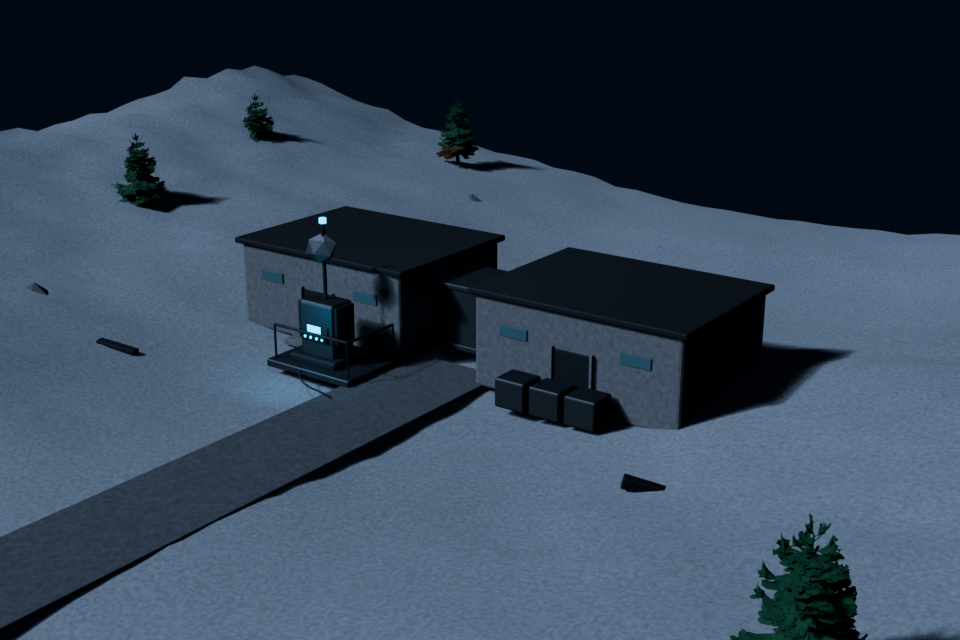

# Visual reference example

## Cold valley outpost / three-quarter overview

This example is the user-provided 16:9 reference image from the project conversation. The original PNG is committed at [`references/cold-valley-outpost-three-quarter-overview.png`](./references/cold-valley-outpost-three-quarter-overview.png). It is a visual-quality and composition reference, not a source mesh or texture.

### What the reference establishes

- A compact two-building research base sits in the middle of a broad, mostly empty snow-covered valley.
- The buildings are low, rectangular, practical concrete volumes with dark flat roofs and a readable gap/connector between them.
- A clear dark approach road leads directly to the entry; the road, doors, and building spacing remain legible from the overview camera.
- The communications terminal is placed by the left entrance and reads as the scene's most detailed object through its antenna, screen glow, platform, and silhouette.
- Pine trees are sparse, separated, and placed on the surrounding slopes rather than packed around the base.
- Rocks and abandoned equipment are deliberately sparse; the ground remains the dominant negative space.
- Lighting is a cold low-angle winter setup with strong but readable shadows. The shadow side must retain enough fill to show building form.

### Asset-quality interpretation

Use this image to evaluate the representation choice, not to force every object into a generated mesh:

| Asset group | Required representation | Acceptance cue |
| --- | --- | --- |
| Buildings, connector, road, terrain | Procedural / editable | Clean manufactured masses and stable spatial relationships |
| Communications terminal | Local generated GLB required | Distinct silhouette, layered parts, weathering, controls, and antenna detail |
| Near or mid-ground pines | Local generated GLB preferred; required for hero-visible trees | Irregular branch silhouette, visible trunk/root contact, non-conical profile |
| Rocks and industrial boxes | Existing local GLB preferred, otherwise controlled procedural instances | Variation in silhouette and material response without clutter |
| Distant debris | Procedural or low-cost instanced asset | Does not compete with the terminal |

### Automated review gates

The scene should fail review when any of these are true:

1. A hero-visible tree is still a cone, stacked primitive, or visibly repeated clone.
2. A generated tree or prop is floating or buried at the terrain contact.
3. The terminal is not the most detailed and visually legible asset near the entrance.
4. The approach road or the building-to-connector relationship is lost in the overview camera.
5. Dark-side lighting hides the connector, entry, or hero asset.
6. Random debris fills the negative space or becomes a stronger focal point than the terminal.

The committed image and this document together provide a stable, reviewable representation of the reference and its intent.
